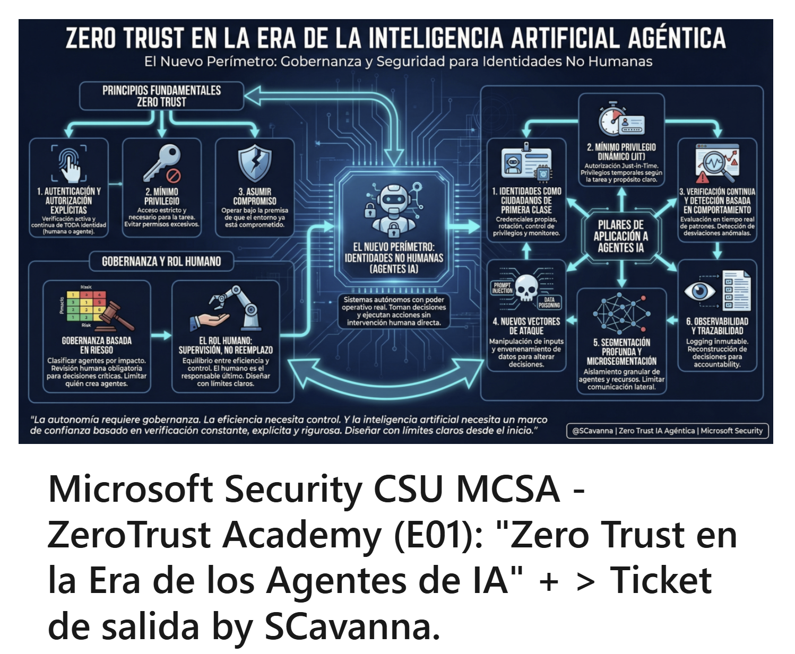

# Microsoft Security CSU MCSA - ZeroTrust Academy (E01): "Zero Trust en la Era de los Agentes de IA" + > Ticket de salida by SCavanna. | LinkedIn

## A) **Publicacion original (linkedin) y otros links de interes**

- [Microsoft Security CSU MCSA - ZeroTrust Academy (E01): "Zero Trust en la Era de los Agentes de IA" + > Ticket de salida by SCavanna. | LinkedIn](https://www.linkedin.com/pulse/microsoft-security-csu-mcsa-zerotrust-academy-gedzf/?trackingId=wxolqtnVOL4b1DY63KCFLg%3D%3D)
- Webinar >> [Zero Trust en la era de los Agentes](https://www.linkedin.com/events/zerotrustenlaeradelosagentes7429895472342786048/theater/)
- Video disponible tambien en >> https://www.youtube.com/watch?v=eAJ2Gt-8LRI

------

## B) **Infografias compiladas en PPTx / PDF**

 [Microsoft Security CSU MCSA - ZeroTrust Academy (E01).pptx](https://github.com/scavanna/SCavanna-PoV/blob/main/ZeroTrustAcademy/E01/Microsoft%20Security%20CSU%20MCSA%20-%20ZeroTrust%20Academy%20(E01).pptx)

 [Microsoft Security CSU MCSA - ZeroTrust Academy (E01).pdf](https://github.com/scavanna/SCavanna-PoV/blob/main/ZeroTrustAcademy/E01/Microsoft%20Security%20CSU%20MCSA%20-%20ZeroTrust%20Academy%20(E01).pdf) 

------

## C) **Repositorio de Imagenes en Alta definicion**

https://github.com/scavanna/SCavanna-VisualRep/blob/main/SCavanna_PoV/ZeroTrustAcademy/ZeroTrustAcademy_E01-Base/

------

## D) **Zero Trust en la Era de la Inteligencia Artificial Agéntica: Notas**

### El Problema: Un Perímetro que Vuelve a Cambiar

Durante casi una década, los profesionales de ciberseguridad hablaron de Zero Trust como la evolución lógica del perímetro de seguridad. El mantra —*nunca confíes, siempre verifica*— respondía a un cambio concreto: cuando el trabajo dejó de ocurrir en un lugar físico fijo y comenzó a producirse desde cualquier dispositivo y desde cualquier lugar, los controles perimetrales tradicionales perdieron relevancia. En ese momento, la identidad pasó a ser el nuevo perímetro.

Hoy ese perímetro vuelve a desplazarse.

En la era de la inteligencia artificial agéntica, los sistemas ya no se limitan a generar texto, clasificar datos o producir imágenes. Toman decisiones, ejecutan acciones y encadenan tareas de forma autónoma, sin intervención humana directa. Esto introduce una categoría de identidades radicalmente distinta: **las identidades no humanas**. Agentes, bots, microservicios y procesos automatizados actúan en nombre de las personas y de las organizaciones, con poder operativo real sobre sistemas críticos. El desafío para los equipos de seguridad es ahora doble: gestionar los riesgos de la identidad humana *y* los de estas nuevas identidades, generalmente con los mismos recursos, el mismo equipo y el mismo presupuesto.

---

### Marco Conceptual: Qué es Zero Trust y Qué es IA Agéntica

Antes de analizar la intersección de ambos conceptos, conviene precisar cada uno por separado.

**Zero Trust no es un producto ni una solución.** Es un modelo de arquitectura, una forma de pensar y diseñar la ciberseguridad, sustentado en tres principios centrales:

1. **Autenticación y autorización explícitas**: toda identidad —humana o no— debe ser verificada de manera activa y continua.
2. **Mínimo privilegio**: el acceso se otorga con los permisos estrictamente necesarios para la tarea en cuestión.
3. **Asumir compromiso**: operar siempre bajo la premisa de que el entorno ya está comprometido.

En la práctica, esto se traduce en autenticación fuerte, segmentación de red, control de acceso granular y monitoreo constante. Una forma útil de resumirlo: *¿qué me vas a dar para que yo confíe en ti?* La confianza no se asume; se gana y se verifica de forma permanente.

**La IA agéntica**, por su parte, no debe confundirse con un modelo de lenguaje que genera texto. Se trata de sistemas con capacidad autónoma —o predominantemente autónoma— de planificar, ejecutar, iterar y tomar decisiones en función de un objetivo. Un agente puede recibir una instrucción como *"optimiza los costos en la nube"* y, a partir de allí, pausar recursos, modificar configuraciones o negociar con APIs externas, todo sin supervisión directa. Estos sistemas suelen tener acceso a herramientas como APIs internas, repositorios, sistemas de ticketing y CRM; manejan contexto, pueden encadenar acciones y se adaptan en tiempo real.

El problema de seguridad no reside en que los agentes sean maliciosos. Reside en que **tienen poder operativo real**, y ese poder debe ser gestionado con la misma rigurosidad —o mayor— que el de cualquier usuario humano.

---

### Los Pilares de Zero Trust Aplicados a los Agentes

#### 1. Identidades No Humanas como Ciudadanos de Primera Clase

Cada agente, bot, microservicio o proceso automatizado debería contar con sus propias credenciales, tokens, certificados y API keys. Zero Trust debe tratar estas identidades con la misma exigencia que aplica a las personas: autenticación fuerte, rotación de credenciales, control de privilegios y monitoreo continuo.

Un ejemplo concreto: un agente que analiza código no debería tener permisos para hacer deployment en producción sin revisión humana. Un agente de facturación no debería tener acceso transitivo a sistemas que no forman parte de su propósito. La separación de funciones no es negociable, y esto aplica tanto a los humanos como a los sistemas autónomos.

Un patrón que ya existía antes y que hoy se vuelve más crítico: incidentes donde el análisis forense revelaba que el adversario había explotado credenciales asociadas a un proceso que corría una vez por semestre —credenciales de un empleado que ya no trabajaba en la empresa, pero que nadie había dado de baja porque el proceso seguía funcionando. Lo que antes era un script mal gestionado, mañana será un agente mal diseñado.

#### 2. Mínimo Privilegio Dinámico

Implementar el principio de mínimo privilegio siempre fue difícil. En muchos entornos, los permisos se otorgan en exceso para evitar fricciones operativas —porque es más fácil dar acceso amplio que administrar accesos granulares. Con agentes autónomos, esa práctica se vuelve inaceptable: la cantidad de procesos y agentes crece exponencialmente y la superficie de riesgo se multiplica con ella.

La complejidad adicional que introducen los agentes es el dinamismo: un agente puede necesitar distintos permisos según la tarea que esté ejecutando en un momento dado. Para responder a eso, cobran relevancia mecanismos como la **autorización just-in-time**, donde los privilegios se otorgan temporalmente y se revocan al finalizar la acción. Esto requiere integración profunda entre los sistemas de identidad, los motores de política y las plataformas de ejecución de los agentes.

Un principio de diseño fundamental: **el agente debe tener un propósito claro**. Cuando ese propósito está bien definido, es posible acotar con precisión a qué recursos debe tener acceso. Un agente de triage de phishing necesita acceso a APIs de threat intelligence, no al CRM de la empresa. Cuando el propósito es difuso, los permisos tienden a expandirse sin control.

#### 3. Verificación Continua y Detección Basada en Comportamiento

En el mundo humano, la verificación continua tiene referentes claros: el estado del dispositivo, la ubicación geográfica, el cumplimiento de políticas. El *impossible travel* —conectarse desde México y desde Rusia en el mismo lapso de treinta minutos— es un indicador que cualquier sistema de detección puede evaluar con relativa facilidad.

En el mundo de los agentes, la evaluación es más compleja y más difusa. El foco debe estar en los **patrones de comportamiento**: volúmenes de requests, tipos de operaciones, desviaciones respecto a la línea base de actividad. Un agente que históricamente realiza consultas de solo lectura y que comienza a ejecutar operaciones destructivas debe disparar una alerta. Un agente que opera dentro de ciertos horarios y cambia su patrón sin estímulo identificable debe ser evaluado.

Validar el token al inicio de la sesión no es suficiente. La confianza debe recalcularse en tiempo real, de forma continua, a lo largo de toda la ejecución. Y aquí aparece una conclusión difícil de eludir: **no es posible monitorear inteligencia artificial sin inteligencia artificial**. La escala y la velocidad de los agentes hacen imposible la supervisión puramente humana. Es fuego contra fuego.

#### 4. Nuevos Vectores de Ataque: Prompt Injection y Data Poisoning

La era de la IA agéntica no solo amplía la superficie de ataque existente; introduce vectores genuinamente nuevos.

El **prompt injection** no es únicamente un problema de generación de texto incorrecto. Puede convertirse en un mecanismo para manipular a un agente que tiene acceso a herramientas críticas. Si un agente que gestiona infraestructura puede ser influenciado por contenido externo malicioso, un atacante podría inducirlo a ejecutar acciones no previstas. El ejemplo es ilustrativo: un correo de phishing procesado por un agente de triage que contiene instrucciones ocultas en su cuerpo —instrucciones que anulan el propósito original del agente y le ordenan realizar otra acción.

El **data poisoning** opera de forma análoga pero en la capa de datos: si alguien envenena la información que consume un agente, puede influir directamente en las decisiones que toma. Esto introduce una dimensión que Zero Trust no necesitaba contemplar en el mundo humano: no basta con controlar a qué recursos accede un agente; hay que controlar también qué información está consumiendo, porque esa información puede modificar su comportamiento.

La respuesta requiere aislamiento de herramientas, validación y sanitización de inputs, y políticas explícitas sobre el pipeline completo de datos que alimenta a cada agente. También implica limitar quién puede crear agentes y con qué capacidades, y establecer controles sobre las interacciones entre agentes —porque la posibilidad de que un agente construya o instruya a otros agentes multiplica exponencialmente el riesgo.

#### 5. Segmentación Profunda y Microsegmentación

La segmentación fue siempre una de las respuestas tradicionales de Zero Trust, especialmente para contener movimientos laterales. Cuanto menos segmentado está un entorno, mayor es el daño potencial si una identidad es comprometida.

Con agentes autónomos, la segmentación debe ser todavía más granular, porque la cantidad de identidades activas crece de forma drástica. No todos los agentes deberían poder comunicarse entre sí. No todos deberían tener visibilidad sobre los mismos datos. La segmentación lógica y de red debe alinearse con los objetivos de negocio y los perfiles de riesgo de cada proceso.

Este principio se vuelve especialmente crítico cuando los agentes interactúan con sistemas externos: la superficie de ataque se expande de forma significativa en cada punto de integración con el exterior.

#### 6. Observabilidad y Trazabilidad como Requisitos de Gobernanza

Si un agente toma una decisión que genera un incidente, debe ser posible reconstruir qué input recibió, qué razonamiento aplicó y qué acciones ejecutó. Sin esa capacidad, no existe accountability. Y sin accountability, la autonomía es un riesgo absoluto.

Esto exige logging detallado e **inmutable** —que no pueda ser alterado después del hecho— y la capacidad de correlacionar cada acción del agente con su identidad, el contexto de ejecución y la política que se aplicó. La observabilidad no es un lujo técnico; es un requisito de gobernanza equiparable a contratar un seguro: se construye para no necesitar usarlo, pero cuando se necesita, su ausencia hace imposible cualquier investigación.

La pregunta de si las herramientas actuales están preparadas para este nivel de trazabilidad tiene una respuesta matizada: las herramientas existen y tienen capacidad suficiente para comenzar. El desafío real es la adopción: si las organizaciones cuentan con la infraestructura adecuada y están dispuestas a instrumentarla correctamente. Y a medida que surjan situaciones nuevas —inherentes a cualquier tecnología emergente— las herramientas también deberán evolucionar.

---

### Gobernanza: No Todos los Agentes Son Iguales

Un agente que responde consultas internas tiene un perfil de riesgo radicalmente diferente al de un agente que ejecuta pagos o modifica configuraciones de seguridad. Del mismo modo que distintos empleados tienen distintos niveles de acceso y distintos controles asociados, los agentes deben clasificarse según su impacto potencial.

Esto implica integrarse con los procesos de gestión de riesgos de la organización: no puede diseñarse la gobernanza de un agente sin entender cuánto puede costar que ese agente falle o sea comprometido. Para decisiones de alto impacto —pagos por encima de cierto monto, modificaciones de configuración crítica, exportación masiva de datos— debería existir revisión humana obligatoria. Para operaciones de menor impacto, la autonomía puede ser mayor.

Un principio concreto: el agente debería heredar, como máximo, los permisos del usuario que lo creó. Si quien crea el agente no tiene acceso a las bases de datos de finanzas, el agente tampoco debería tenerlo. Esto requiere, sin embargo, que los permisos de los usuarios estén bien segmentados —lo que dista de ser la norma en la mayoría de las organizaciones.

También es necesario limitar **quién puede crear agentes**. Permitir que cualquier persona de la organización construya agentes con acceso a sistemas críticos conduce a una anarquía de agentes difícil de gobernar. El gobierno de agentes debe ser una función explícita, no una consecuencia no planificada de la adopción tecnológica.

---

### El Rol Humano: Supervisión, No Reemplazo

La narrativa dominante sobre IA agéntica tiende a enfatizar la autonomía total. La realidad de las organizaciones responsables es distinta: los modelos que funcionan son híbridos, donde el humano permanece como responsable último.

Zero Trust no reemplaza la supervisión humana; la complementa. El desafío consiste en encontrar el equilibrio entre eficiencia y control: si se impone demasiada fricción, se elimina el beneficio de la automatización; si se otorga demasiada autonomía, se materializan todos los riesgos descritos. Encontrar ese balance es más arte que ciencia, y requiere hacerse una pregunta concreta por cada agente: *¿cuánto confío en este agente para esta tarea específica, como para dejarlo operar de forma autónoma?*

Para tareas de bajo impacto —generar un resumen, clasificar un correo, redactar un borrador— la autonomía puede ser amplia. Para tareas de alto impacto —ejecutar un pago, modificar una configuración de seguridad, compartir información sensible—, la intervención humana debe ser parte del diseño, no una excepción.

---

### Conclusión: Diseñar con Límites Claros, Antes de que Sea Tarde

Zero Trust en la era de los agentes no es un tema opcional. Las organizaciones que adoptan IA agéntica sin un marco de confianza explícito están reproduciendo un patrón conocido: permitir todo primero, gestionar las consecuencias después. Ese ciclo tiene costos elevados.

El objetivo no es frenar la innovación. Es diseñarla con límites claros desde el inicio: definir el propósito de cada agente, acotar sus permisos en función de ese propósito, verificar su comportamiento de forma continua, mantener trazabilidad de cada acción y establecer revisión humana en los puntos de mayor impacto.

La autonomía requiere gobernanza. La eficiencia necesita control. Y la inteligencia artificial necesita un marco de confianza que no puede estar basado en suposiciones —sino en verificación constante, explícita y rigurosa. Los equipos de seguridad tienen hoy la responsabilidad de concientizar sobre esto antes de que la complejidad sea inmanejable: cuando la mayoría de las identidades activas en una organización sean no humanas, no habrá margen para improvisar.

------

## E) Texto Base infografias: 

 [Base infografia 1 — El Nuevo Perímetro Identidades No Humanas.md](https://github.com/scavanna/SCavanna-PoV/blob/main/ZeroTrustAcademy/E01/Base%20infografia%201%20%E2%80%94%20El%20Nuevo%20Per%C3%ADmetro%20Identidades%20No%20Humanas.md) 

 [Base Infografía 2 — Mínimo Privilegio y Control de Acceso para Agentes.md](https://github.com/scavanna/SCavanna-PoV/blob/main/ZeroTrustAcademy/E01/Base%20Infograf%C3%ADa%202%20%E2%80%94%20M%C3%ADnimo%20Privilegio%20y%20Control%20de%20Acceso%20para%20Agentes.md) 

 [Base Infografía 3 — Nuevas Amenazas Prompt Injection y Data Poisoning.md](https://github.com/scavanna/SCavanna-PoV/blob/main/ZeroTrustAcademy/E01/Base%20Infograf%C3%ADa%203%20%E2%80%94%20Nuevas%20Amenazas%20Prompt%20Injection%20y%20Data%20Poisoning.md) 

 [Base Infografía 4 — Verificación Continua, Observabilidad y Trazabilidad.md](https://github.com/scavanna/SCavanna-PoV/blob/main/ZeroTrustAcademy/E01/Base%20Infograf%C3%ADa%204%20%E2%80%94%20Verificaci%C3%B3n%20Continua%2C%20Observabilidad%20y%20Trazabilidad.md) 

 [Base Infografía 5 — Gobernanza, Supervisión Humana y Diseño Responsable.md](https://github.com/scavanna/SCavanna-PoV/blob/main/ZeroTrustAcademy/E01/Base%20Infograf%C3%ADa%205%20%E2%80%94%20Gobernanza%2C%20Supervisi%C3%B3n%20Humana%20y%20Dise%C3%B1o%20Responsable.md) 

# 
